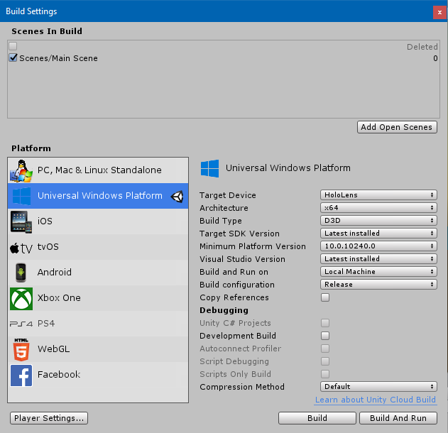
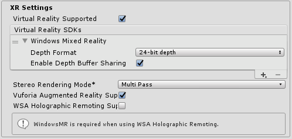
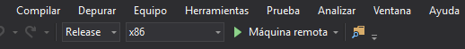
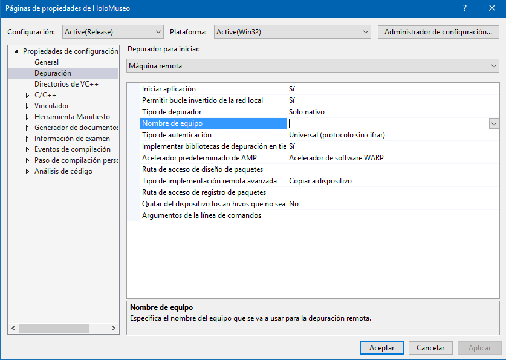

# HoloMuseo

HoloLens application for museums and exhibitions where you can present multimedia content by detecting markers of Vuforia. Both content and markers can be customized as they are obtained from an [external server](https://github.com/osabogal10/HoloServer).

## Required Software

since this project is based on the latest stable release of HoloToolKit at the date [ HoloToolKit 2017.4.3](https://github.com/microsoft/MixedRealityToolkit-Unity/releases/tag/2017.4.3.0-Refresh) you need the following software installed

 |  [Windows SDK 18362+](https://developer.microsoft.com/en-US/windows/downloads/windows-10-sdk)|  [Unity 2018.3.5](https://unity3d.com/get-unity/download/archive)|  [Visual Studio 2017](http://dev.windows.com/downloads)|
| :--- | :--- | :--- |
| To develop apps for Windows Mixed Reality headsets, you need the Windows 10 Fall Creators Update | The Unity 3D engine provides support for building mixed reality projects in Windows 10 (Others versions may work but have not been tested)| Visual Studio is used for code editing, deploying and building UWP app packages |

## Installing

Once you've cloned the project to your computer.

Open the Unity project by selecting the root folder

On File -> Build Settings be sure that target platform is set to Universal Windows Platform and Device is HoloLens

On player settings Windows Mixed Reality and Vuforia support must be enabled

To run this project don't forget to add your Vuforia license key inside the MixedRealityCamera object you will find the Vuforia Behaviour component.

If you don't have a license key you can get one for free on [Vuforia Developers Portal](https://developer.vuforia.com/vui/pricing)

Now you will be able to run the app on Editor

## Build and Deploy to HoloLens

Because we are using Vuforia Engine, it is not possible to run the app in the HoloLens Emulator,then you will have to build the application and run it on a physical device.

Go to File -> Build Settings and Build the project.
Create a new Folder called "App" and select that folder

When the process is finished you can go to the App folder and open the Visual Studio solution.

Select Release, X86 and Remote machine in build configuration options.

Select Debug -> Properties

Debugging set the IP address from your HoloLens under the Device Name property.

Now you can Start the deploy. It can take a few minutes.

## Built With

* [Unity](https://unity3d.com/es/get-unity/download)
* [MRTK-Unity](https://github.com/microsoft/MixedRealityToolkit-Unity) - Useful prefabs, tutorials and develop tools
* [Vuforia](https://developer.vuforia.com) - Used to track ImageTargets
* [rizasif/vuforia-runtime-dataset-sample](https://github.com/rizasif/vuforia-runtime-dataset-sample) - Helped in the dynamic load of the Vuforia dataset.
* [NSudharsan](https://github.com/NSudharsan/HoloLensExamples) - Nice and well explained examples https://codeholo.com

## Authors

* **Orlando Sabogal Rojas** - [osabogal10](https://github.com/osabogal10)

Under the valuable advice of **Pablo Figueroa** - p.figuero@uniandes.edu.co

## License

This project is licensed under the MIT License - see the [LICENSE.md](LICENSE.md) file for details